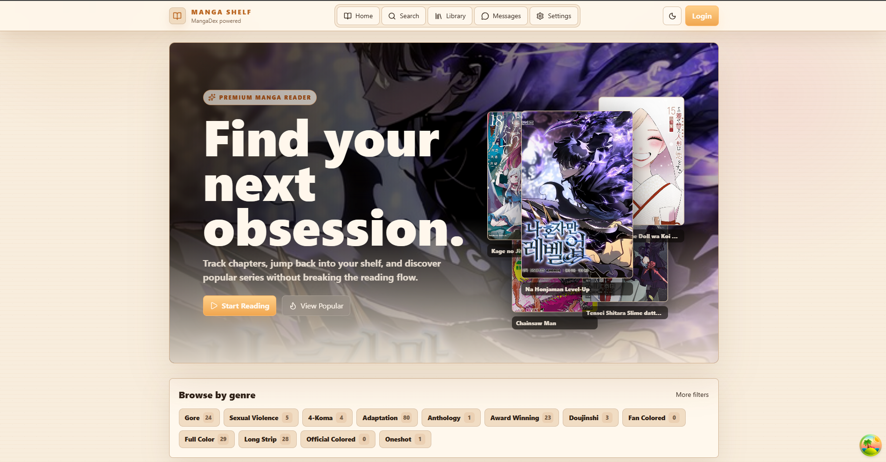

# MangaDex Reader

Fullstack manga reader built with Fastify, Prisma, PostgreSQL, Redis, React, Vite, and Tailwind CSS v4.

## Requirements

- Node.js 22+
- Docker Desktop, for PostgreSQL and Redis

## Local Setup

```bash
npm install
copy backend\.env.example backend\.env
copy frontend\.env.example frontend\.env
docker compose up -d postgres redis
npm run prisma:generate -w backend
npm run prisma:migrate -w backend
npm run dev
```

Backend: `http://localhost:4000`

Frontend: `http://localhost:5173`

Swagger UI: `http://localhost:4000/docs`

PostgreSQL is exposed on host port `55432` to avoid conflicts with a local PostgreSQL service on `5432`.

## Useful Commands

```bash
npm run typecheck --workspaces
npm run test --workspaces
npm run build --workspaces
```

## Production Compose

```bash
copy .env.prod.example .env
docker compose -f docker-compose.prod.yml build
docker compose -f docker-compose.prod.yml up -d
curl http://localhost/health/ready
```

Set `JWT_SECRET`, `POSTGRES_PASSWORD`, and `CORS_ORIGIN` in `.env` for the VPS environment before starting the production stack. Set `PUBLIC_MEDIA_BASE_URL` to the Cloudflare-proxied API or media hostname when enabling CDN media caching.

## Local Nginx Smoke Test

Use this when you want a production-like same-origin Nginx path without replacing the normal Vite dev server on `http://localhost:5173`.

```bash
copy .env.nginx.local.example .env.nginx.local
docker compose --env-file .env.nginx.local -f docker-compose.prod.yml up --build
```

The app is served at `http://localhost:8080`. Nginx serves the built frontend and proxies `/api`, `/health`, `/docs`, `/uploads`, and `/socket.io` to the backend service.

Smoke checks:

```bash
curl http://localhost:8080/health
curl http://localhost:8080/health/ready
curl "http://localhost:8080/api/manga/search?q=one"
curl http://localhost:8080/docs/json
curl "http://localhost:8080/socket.io/?EIO=4&transport=polling"
```

Also open `http://localhost:8080` in a browser and refresh a deep route to confirm the SPA fallback.

Stop the stack:

```bash
docker compose --env-file .env.nginx.local -f docker-compose.prod.yml down
```

## Notes

- MangaDex metadata is requested through the backend and cached in Redis.
- MangaDex catalog data is also persisted in PostgreSQL via `CachedManga` and `CachedChapter`.
- Run `npm run sync:mangadex -w backend -- --limit=48 --chapters` to manually import manga and first chapter feeds.
- Narrow syncs are supported, for example `npm run sync:mangadex -w backend -- --query=chainsaw --languages=vi,en --limit=12 --chapters --chapters-limit=64`.
- Set `SYNC_ON_STARTUP=true` in `backend/.env` to run a non-blocking catalog sync when the backend starts.
- Reader image URLs are resolved through MangaDex AtHome metadata and proxied through the backend for local reliability.
- Default translated languages are Vietnamese and English.
- Backend OpenAPI JSON is available at `/docs/json`; Swagger UI is available at `/docs`.

## Documentation



- [Agent rules](AGENTS.md): coding-agent rules, including detailed commit message requirements.
- [Feature status](docs/FEATURE_STATUS.md): current implemented features, known limits, and not-yet-implemented roadmap items.
- [User feature roadmap](docs/USER_FEATURE_ROADMAP.md): role `USER` feature gaps with detailed implementation plans.
- [Focused gap roadmap](docs/FOCUSED_GAP_ROADMAP.md): milestone order for backend contracts, discovery accuracy, reader UX, personalization, account maturity, and mobile readiness.
- [Database schema](docs/DATABASE_SCHEMA.md): current Prisma data model, catalog cache behavior, and operational checks for readable chapters.
- [Catalog data workflow refactor](docs/catalog-data-workflow/README.md): step-by-step plan to separate frontend DB reads from MangaDex import/sync operations.
- [Admin workflow](docs/admin-workflow/README.md): step-by-step plan for full admin API and admin UI implementation.
- [Reader and chapter navigation plan](docs/READER_CHAPTER_NAVIGATION_PLAN.md): MVP behavior, interfaces, and test scenarios for reader navigation.
- [Chapter list advanced plan](docs/CHAPTER_LIST_ADVANCED_PLAN.md): MVP behavior, filters, infinite scroll, and test scenarios for advanced chapter browsing.
- [Wibu manga cafe theme plan](docs/WIBU_MANGA_CAFE_THEME_PLAN.md): warm anime-native visual direction and acceptance checks.
- [Library personalization plan](docs/LIBRARY_PERSONALIZATION_PLAN.md): Home continue reading, recently read, and library search/sort MVP.
- [Manga discovery plan](docs/MANGA_DISCOVERY_PLAN.md): advanced search filters, sort modes, discovery routes, and cache fallback behavior.
- [Auth and account plan](docs/AUTH_ACCOUNT_PLAN.md): account settings, profile updates, password change, and backend logout behavior.
- [RAG chatbot MVP plan](docs/RAG_CHATBOT_PLAN.md): authenticated floating chatbot, pgvector indexing, retrieval flow, and step-by-step delivery status.
- [RAG chatbot workflow overview](docs/RAG_CHATBOT_WORKFLOW_VI.md): plain-language Vietnamese explanation of how the RAG chatbot works end to end.
- [Push notifications plan](docs/PUSH_NOTIFICATIONS_PLAN.md): Android-first Firebase Cloud Messaging architecture, backend token storage, and mobile routing.
- [Backend/Ops deploy plan](docs/BACKEND_OPS_PLAN.md): production Docker Compose, CI checks, health readiness, and VPS runbook.
- [Local Nginx setup](docs/LOCAL_NGINX_SETUP.md): local production-like Nginx setup, smoke tests, and route-by-route explanation.
- [Image traffic scale plan](docs/IMAGE_TRAFFIC_SCALE_PLAN.md): backend media proxy hardening, Cloudflare CDN rules, and future object storage cache.
- [Cloudflare media cache runbook](docs/CLOUDFLARE_MEDIA_CACHE_RUNBOOK.md): exact cache rules, bypass rules, rate limits, and verification steps for media traffic.
